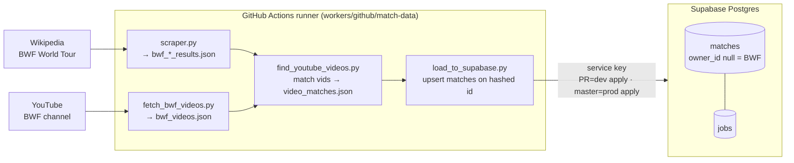
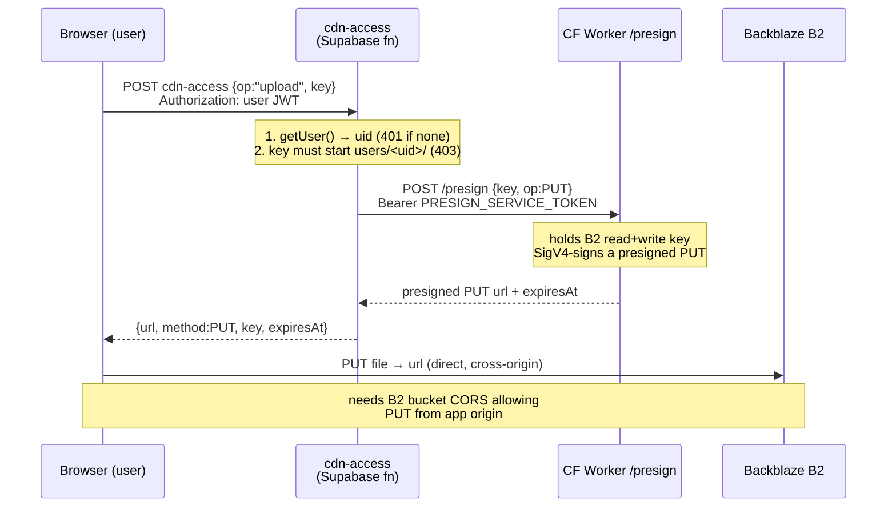
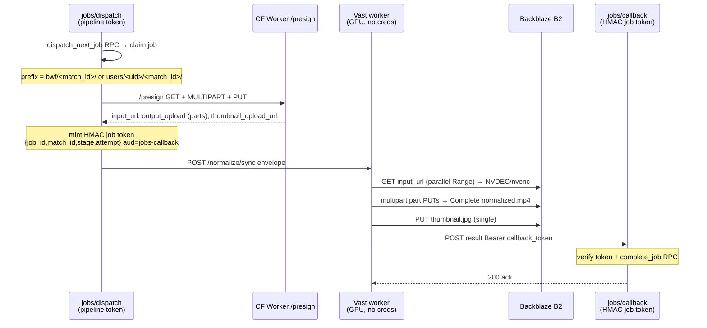
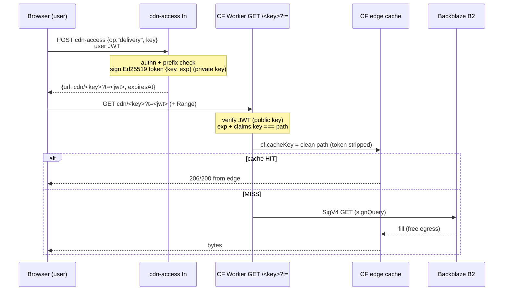

# Mintonix — Data Flows

Four independent pipelines. Two touch the **match-data DB** (content metadata),
two touch **B2 storage via the CDN** (user video bytes). The design rule that
ties the storage flows together: **B2 credentials live in exactly one place —
the Cloudflare Worker.** Everything else moves through one-time capabilities
(signed view tokens, presigned URLs, HMAC job tokens).

```
                        ┌──────────────────────────────────────────┐
                        │  SUPABASE  (DB + Edge Functions)           │
                        │  matches / players / … tables              │
                        │  cdn-access · normalize-video · -callback  │
                        └──────────────────────────────────────────┘
      metadata plane  ▲                                   ▲  storage-control plane
  (1) match-data ─────┘                     (2)(3)(4) ────┘
                                                    │
                                     ┌──────────────┴───────────────┐
                                     │  Cloudflare Worker (CDN)      │  ◀─ only B2 creds
                                     │  /presign  ·  GET /<key>?t=   │
                                     └──────────────┬───────────────┘
                                                    │ free egress (Bandwidth Alliance)
                                              ┌─────┴─────┐
                                              │  Backblaze │
                                              │  B2 bucket │
                                              └───────────┘
```

---

## 1. Match-data collection  (GitHub Actions → Supabase DB)

Pure metadata. No storage, no users. Runs weekly (cron) or on PR/push scoped to
`workers/github/match-data/**`. PR → **dev DB apply**; push to `master` /
schedule → **prod DB, apply**.



Loads are **idempotent** (`matches.id = sha256(match_key)`). Catalog only —
does not enqueue GPU jobs. See `workers/github/match-data/schema.md`.

---

## 2. Video upload  (browser → B2, direct)

The client asks the orchestrator for a presigned PUT, then uploads **straight to
B2** — bytes never pass through Supabase or the Worker on this path.



Objects live at `users/<uid>/<match_id>/{original.mp4, normalized.mp4,
thumbnail.jpg, annotation.json, …}` (see supabase/README.md). Access control is a
**prefix check**, no DB lookup.

---

## 3. Video preprocess  (compute pathway, credential-free worker)

Kicks off a GPU transcode on a Vast worker that holds **no credentials** — it
gets presigned URLs + an HMAC callback token in the job envelope.



> **Current state:** `jobs` edge function routes normalize → detect; analyze is
> a follow-up. Large objects use CDN `op=MULTIPART`. Callback settles via
> `complete_job`.

The transcode target: **≤1920×1080, ≤30 fps, H.264/yuv420p, AAC**.

---

## 4. Video delivery  (browser → CF edge cache → B2)

Token-gated, **cached** streaming. The orchestrator mints a short-lived Ed25519
view token locally (it holds the private key); the Worker only verifies (public
key) and proxies from B2 through Cloudflare's edge cache.



Cache key is the **path only** (token stripped) → every viewer shares one cached
copy; `Range`/seek served from the edge. Token TTL is short (minutes); the cached
object lives much longer (`CACHE_TTL_SECONDS`).

---

## Trust boundary (why the storage flows look the way they do)

| Component | Holds | Can it… |
|---|---|---|
| **cdn-access / normalize-*** (Supabase fns) | Ed25519 **private** key · `/presign` service token · HMAC `JOB_TOKEN_SECRET` | mint view tokens & presign-requests ✔ · touch B2 directly ✗ |
| **CF Worker** (edge) | B2 **read+write** key · Ed25519 **public** key · service token | read/write B2 ✔ · mint view tokens ✗ |
| **Vast / ML / analysis workers** | nothing (one-time presigned URLs + callback token per job) | — |

Asymmetric view token ⇒ orchestrator **mints**, edge only **verifies**. Every
token / presign / job-token is **bound to one `key`**, so none can be replayed
against another object.
